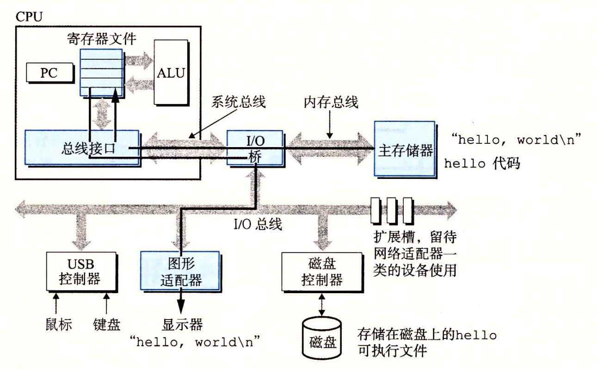

# 1.1 程序编译过程

hello 程序的生命周期是从一个高级 C 语言程序开始的，因为这种形式能够被人读懂。然而，为了在系统上运行 hello.c 程序，每条 C 语句都必须被其他程序转化为一系列的低级**机器语言**指令。然后这些指令按照一种称为**可执行目标程序**的格式打好包，并以二进制磁盘文件的形式存放起来。目标程序也称为**可执行目标文件。**

在 Unix 系统上，从源文件到目标文件的转化是由**编译器驱动程序**完成的∶

**`linux> gcc -o hello hello.c`**

在这里，GCC 编译器驱动程序读取源程序文件 hello.c，并把它翻译成一个可执行目标文件 hello。这个翻译过程可分为四个阶段完成，如图 1-3 所示。执行这四个阶段的程序（**预处理器**、**编译器**、**汇编器**和**链接器**）一起构成了**编译系统**（compilation system）。


* **预处理阶段。**预处理器（cpp）根据以字符 \# 开头的命令，修改原始的 C 程序。比如 hello.c 中第 1 行的`#include <stdio.h>`命令告诉预处理器读取系统头文件 stdio.h 的内容，并把它直接插入程序文本中。结果就得到了另一个 C 程序，通常是以 .i 作为文件扩展名。 
* **编译阶段。**编译器（cc1）将文本文件 hello.i 翻译成文本文件 hello.s，它包含一个**汇编语言程序**。该程序包含函数 main 的定义，如下所示∶
* ```bash
  main:
      subq $8, %rsp
      movl $.LC0, %edi
      call puts
      movl $0, %eax
      addq $8, %rsp
      ret
  ```

  定义中 2～7 行的每条语句都以一种文本格式描述了一条低级机器语言指令。汇编语言是非常有用的，因为它为不同高级语言的不同编译器提供了通用的输出语言。例如，C编译器和 Fortran 编译器产生的输出文件用的都是一样的汇编语言。

* **汇编阶段。**接下来，汇编器（as）将 hello.s 翻译成机器语言指令，把这些指令打包成一种叫做**可重定位目标程序**（relocatable object program）的格式，并将结果保存在目标文件 hello.o 中。hello.o 文件是一个二进制文件，它包含的 17 个字节是函数 main 的指令编码。如果我们在文本编辑器中打开 hello.o文件，将看到一堆乱码。
* **链接阶段。**请注意，hello 程序调用了 printf 函数，它是每个 C 编译器都提供的标准 C 库中的一个函数。printf 函数存在于一个名为 printf.o 的单独的预编译好了的目标文件中，而这个文件必须以某种方式合并到我们的 hello.o 程序中。链接器（ld）就负责处理这种合并。结果就得到 hello 文件，它是一个**可执行目标文件**（或者简称为**可执行文件**），可以被加载到内存中，由系统执行。


### 旁注 - GNU项目

GCC 是 GNU（GNU 是GNU's Not Unix 的缩写）项目开发出来的众多有用工具之一。GNU 项目是 1984 年由 Richard Stallman 发起的一个免税的慈善项目。该项目的目标非常宏大，就是开发出一个完整的类 Unix 的系统，其源代码能够不受限制地被修改和传播。GNU 项目已经开发出了一个包含 Unix 操作系统的所有主要部件的环境，但内核除外，内核是由 Linux 项目独立发展而来的。GNU 环境包括 EMACS 编辑器、GCC 编译器、GDB 调试器、汇编器、链接器、处理二进制文件的工具以及其他一些部件。GCC 编译器已经发展到支持许多不同的语言，能够为许多不同的机器生成代码。支持的语言包括 C、C++、Fortran、Java、Pascal、面向对象 C 语言（Objective-C）和 Ada。

GNU 项目取得了非凡的成绩，但是却常常被忽略。现代开放源码运动（通常和 Linux 联系在一起）的思想起源是 GNU 项目中自由软件（free software）的概念。（此处的free 为自由言论（free speech）中的“自由”之意，而非免费啤酒（free beer）中的“免费”之意。）而且，Linux 如此受欢迎在很大程度上还要归功于 GNU 工具，它们给 Linux 内核提供了环境。



# 1.2 处理器读并解释储存在内存中的指令

此刻，hello.c 源程序已经被编译系统翻译成了可执行目标文件 hello，并被存放在磁盘上。要想在 Unix 系统上运行该可执行文件，我们将它的文件名输入到称为 shell 的应用程序中∶ 

```text
linux> ./hello
hello, world
linux> 
```

shell 是一个命令行解释器，它输出一个提示符，等待输入一个命令行，然后执行这个命令。如果该命令行的第一个单词不是一个内置的 shell 命令，那么 shell 就会假设这是一个可执行文件的名字，它将加载并运行这个文件。所以在此例中，shell 将加载并运行 hello 程序，然后等待程序终止。hello 程序在屏幕上输出它的消息，然后终止。shell 随后输出一个提示符，等待下一个输入的命令行。

## 1.2.1 系统的硬件组成 <a id="1"></a>

为了理解运行 hello 程序时发生了什么，我们需要了解一个典型系统的硬件组织，如图 1-4 所示。这张图是近期 Intel 系统产品族的模型，但是所有其他系统也有相同的外观和特性。现在不要担心这张图很复杂——我们将在本书分阶段对其进行详尽的介绍。

### 1. 总线 <a id="1-1"></a>

贯穿整个系统的是一组电子管道，称作**总线**，它携带信息字节并负责在各个部件间传递。通常总线被设计成传送定长的字节块，也就是字（word）。字中的字节数（即字长）是一个基本的系统参数，各个系统中都不尽相同。现在的大多数机器字长要么是 4 个字节（32 位），要么是 8 个字节（64 位）。本书中，我们不对字长做任何固定的假设。相反，我们将在需要明确定义的上下文中具体说明一个“字”是多大。 

### 2. I/O 设备 <a id="1-2"></a>

I/O（输入/输出）设备是系统与外部世界的联系通道。我们的示例系统包括四个 I/O 设备∶作为用户输入的键盘和鼠标，作为用户输出的显示器，以及用于长期存储数据和程序的磁盘驱动器（简单地说就是磁盘）。最开始，可执行程序 hello 就存放在磁盘上。

每个 I/O 设备都通过一个**控制器**或**适配器**与 I/O 总线相连。控制器和适配器之间的区别主要在于它们的封装方式。控制器是 I/O 设备本身或者系统的主印制电路板（通常称作主板）上的芯片组。而适配器则是一块插在主板插槽上的卡。无论如何，它们的功能都是在 I/O 总线和 I/O 设备之间传递信息。


> 图 1-4 一个典型系统的硬件组成
>
> CPU：中央处理单元；ALU：算术/逻辑单元；PC：程序计数器；USB：通用串行总线

第 6 章会更多地说明磁盘之类的 I/O 设备是如何工作的。在第 10 章中，你将学习如何在应用程序中利用 Unix I/O 接口访问设备。我们将特别关注网络类设备，不过这些技术对于其他设备来说也是通用的。 

### 3. 主存

**主存**是一个临时存储设备，在处理器执行程序时，用来存放程序和程序处理的数据。从物理上来说，主存是由一组**动态随机存取存储器**（DRAM）芯片组成的。从逻辑上来说，存储器是一个线性的字节数组，每个字节都有其唯一的地址（数组索引），这些地址是从零开始的。一般来说，组成程序的每条机器指令都由不同数量的字节构成。与 C 程序变量相对应的数据项的大小是根据类型变化的。比如，在运行 Linux 的 x86-64 机器上，short 类型的数据需要 2 个字节，int 和 float 类型需要 4 个字节，而 long 和 double 类型需要 8 个字节。 第 6 章将具体介绍存储器技术，比如 DRAM 芯片是如何工作的，它们又是如何组合起来构成主存的。 

### 4. 处理器

**中央处理单元**（CPU），简称**处理器**，是解释（或执行）存储在主存中指令的引擎。处理器的核心是一个大小为一个字的存储设备（或**寄存器**），称为**程序计数器**（PC）。在任何时刻，PC 都指向主存中的某条机器语言指令（即含有该条指令的地址）。


PC 也普遍地被用来作为“个人计算机”的缩写。然面，两者之间的区别应该可以很清楚地从上下文中看出来。


从系统通电开始，直到系统断电，处理器一直在不断地执行程序计数器指向的指令，再更新程序计数器，使其指向下一条指令。处理器看上去是按照一个非常简单的指令执行模型来操作的，这个模型是由指令集架构决定的。在这个模型中，指令按照严格的顺序执行，而执行一条指令包含执行一系列的步骤。处理器从程序计数器指向的内存处读取指令，解释指令中的位，执行该指令指示的简单操作，然后更新 PC，使其指向下一条指令，而这条指令并不一定和在内存中刚刚执行的指令相邻。

这样的简单操作并不多，它们围绕着主存、**寄存器文件**（register file）和**算术/逻辑单元**（ALU）进行。寄存器文件是一个小的存储设备，由一些单个字长的寄存器组成，每个寄存器都有唯一的名字。ALU 计算新的数据和地址值。下面是一些简单操作的例子，CPU 在指令的要求下可能会执行这些操作。

* **加载：**从主存复制一个字节或者一个字到寄存器，以覆盖寄存器原来的内容。
* **存储：**从寄存器复制一个字节或者一个字到主存的某个位置，以覆盖这个位置上原 来的内容。 
* **操作：**把两个寄存器的内容复制到 ALU，ALU 对这两个字做算术运算，并将结果存放到一个寄存器中，以覆盖该寄存器中原来的内容。 
* **跳转：**从指令本身中抽取一个字，并将这个字复制到程序计数器（PC）中，以覆盖 PC 中原来的值。

 处理器看上去是它的指令集架构的简单实现，但是实际上现代处理器使用了非常复杂的机制来加速程序的执行。因此，我们将处理器的指令集架构和处理器的**微体系结构**区分开来：指令集架构描述的是每条机器代码指令的效果；而微体系结构描述的是处理器实际上是如何实现的。在第 3 章研究机器代码时，我们考虑的是机器的指令集架构所提供的抽象性。第 4 章将更详细地介绍处理器实际上是如何实现的。第 5 章用一个模型说明现代处理器是如何工作的，从而能预测和优化机器语言程序的性能。

## 1.2.2 运行 hello 程序 <a id="2"></a>

前面简单描述了系统的硬件组成和操作，现在开始介绍当我们运行示例程序时到底发生了些什么。在这里必须省略很多细节，稍后会做补充，但是现在我们将很满意于这种整体上的描述。 初始时，shell 程序执行它的指令，等待我们输人一个命令。当我们在键盘上输人字符串 “./hello” 后，shell 程序将字符逐一读入寄存器，再把它存放到内存中，如图 1-5 所示。


当我们在键盘上敲回车键时，shell 程序就知道我们已经结束了命令的输入。然后 shell 执行一系列指令来加载可执行的 hello 文件，这些指令将 hello 目标文件中的代码和数据从磁盘复制到主存。数据包括最终会被输出的字符串 “hello, world\n”。

利用**直接存储器存取**（DMA，将在第 6 章中讨论）技术，数据可以不通过处理器而直接从磁盘到达主存。这个步骤如图 1-6 所示。


一旦目标文件 hello 中的代码和数据被加载到主存，处理器就开始执行 hello 程序的 main 程序中的机器语言指令。这些指令将 “hello, world\n” 字符串中的字节从主存复制到寄存器文件，再从寄存器文件中复制到显示设备，最终显示在屏幕上。这个步骤如图 1-7 所示。




# 1.3 AT&T汇编语言sample <a id="2"></a>


cpuid_x64.s

```
#cpuid.s Sample program to extract the processor Vendor ID
#build and output(编译和输出)
#as -o cpuid_x64.o cpuid_x64.s
#ld -o cpuid_x64 cpuid_x64.o
.code64
.section .data
output:
   .ascii "The processor Vendor ID is 'xxxxxxxxxxxx'\n"
   .equ len, . - output
.section .text
.globl _start
_start:
   movl $0, %eax
   cpuid
   movl $output, %edi
   movl %ebx, 28(%edi)
   movl %edx, 32(%edi)
   movl %ecx, 36(%edi)
# std print syscall
   movq $1, %rax
   movq $1, %rdi
   movq $output, %rsi
   movq $len, %rdx
   syscall

# SYS_EXIT syscall
   movq $0, %rdi
   movq $60,%rax
   syscall


```

cpuid2_x64.s

```
#cpuid2.s View the CPUID Vendor ID string using C library calls
#build and output(编译和输出)
#as -o cpuid2_x64.o cpuid2_x64.s
#ld -o cpuid2_x64  cpuid2_x64.o -lc -I /lib64/ld-linux-x86-64.so.2
.code64
.section .data
output:
    .asciz "The processor Vendor ID is '%s'\n"
.section .bss
    .lcomm buffer, 12
.section .text
.globl _start
_start:
    movl $0, %eax
    cpuid
    movq $buffer, %rdi
    movl %ebx, (%rdi)
    movl %edx, 4(%rdi)
    movl %ecx, 8(%rdi)

 #change the parameter to register
    movq $buffer, %rsi
    movq $output, %rdi
    call printf
 #use the c library exit
    movq $0, %rdi
    call exit

```

与C语言编译过程如上图相比，汇编语言少了 **预处理阶段** **汇编阶段**


